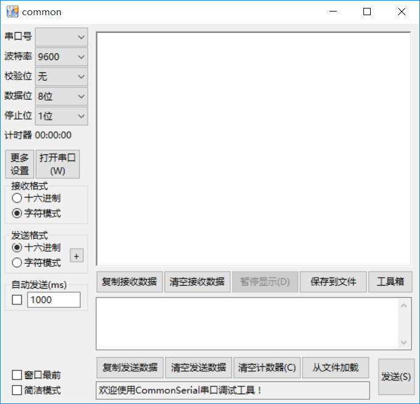
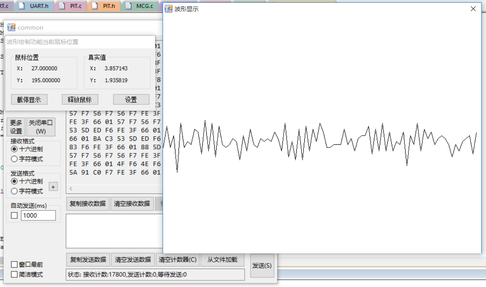
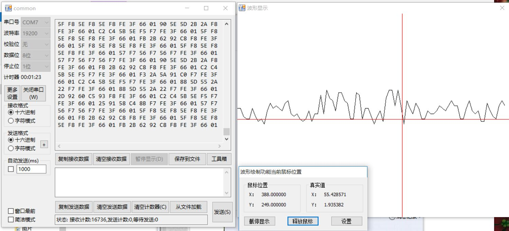

# Windows平台串口通信调试助手

## 版本信息

CommonSerial Copyright (C)  2017 @KondeU

当前最新版本：2.01_Release

最新发布日期：2017年12月27日

开发者：	女孩不哭、KondeU

问题反馈与联系：https://github.com/KondeU/CommonSerialRelease

第二版本（2.01）支持波形绘制的功能，可以将串口助手用作示波器、PID调参器使用。

## 使用预览

主窗口：

波形绘制窗口：

## 使用说明

因程序涉及串口硬件操作，有可能会被杀毒软件误报威胁，请放心添加信任使用。

本应用程序为免费软件，不收取任何费用，在使用过程中如有疑问或报告异常，可发邮件至用户反馈邮箱或在上述问题反馈与联系网站的Issues中发布。

### 软件说明

1. 软件用C/C++语言+Win32API方式编写，程序高效简洁，不会产生任何系统附属文件。
2. 实现对串口的读取与写入，提供16进制与字符方式两种显示方式。
3. 支持文件发送与保存至文本。
4. 支持自动发送，自定义发送周期。
5. 自动识别已有串口，检测新串口的插入与已插入串口的移除。
6. 支持DTR/RTS引脚电平控制。
7. 提供ASCII码表供代码转换时参考。
8. 提供方便地打开计算器、记事本、设备管理器的工具箱选项。
9. 接收字符数据时，提供对“\b”控制字符支持。
10. 提供波形绘制功能，方便动态调参。

### 软件参数

- 最大发送文件大小：1MB（1048576字节）实际文件大小。
- 发送区最大文本大小：与最大发送文件大小相同。
- 数据接收区缓冲区大小（16进制与文本字符一致）：10MB。
- 读串口数据时,一次性最大读取大小：1MB。

### 使用帮助

先设置好串口的参数，然后打开串口进行读写。
例如，一般设置（实际情况应参考硬件）：

​	波特率：9600
​	校验位：无
​	数据位：8位
​	停止位：1位

串口在以极高的速度收发数据时请勿直接关闭串口，否则有可能造成端口无法释放，程序线程会无法正常退出。

### 其它

- 自动发送时间间隔范围：50ms~60000ms。
- 开启自动发送后将不允许手动发送。
- 若修改发送数据, 自动发送将被取消。
- 16进制发送格式为：2个16进制位间需加1个空格。

### （第2版本）波形绘制功能的使用

- 鼠标在窗口中移动可以在鼠标监测对话框中看到当前的位置状态。
- CTRL+鼠标左键可以锁定/解锁鼠标的选中。
- CTRL+鼠标右键可以上下平移垂直轴，即上下平移量程。
- CTRL+鼠标滚轮可以使垂直轴的采样数据区间等比缩放，等比增大或减小量程。
- CTRL+SHIFT+鼠标滚轮可以调节水平轴采样绘图间距。
- 空格键可以暂停图像做研究，再按一次继续显示图像，暂停时数据仍然在后台接收。

- 在设置中可以设定窗口大小、绘制点大小、量程以及输入类型。

  支持的输入类型有：

  ​	BYTE(1byte)、

  ​	WORD(2bytes)、

  ​	DWORD(4bytes)、

  ​	FLOAT(4bytes)、

  ​	DOUBLE(8bytes)。

- 接收数据协议（下位机编程协议）：

  1. 多字节数据按小端序方式解码。

  2. 定义转义字符为0x66，当下位机需要发送（串口助手接收）的字节为0x66时，请连续发送两个0x66。

  3. 为了保证字节序的准确性，要求下位机程序每隔一定的时间周期（参考时间约为1s）向串口助手发送0x66 0x01以重新对齐接收字节序。

  4. 当下位机需要停止串口助手的波形显示而又不影响串口助手其他数据的正常收发时，可向串口助手发送0x66 0x02以停止波形显示，当收到0x66 0x01时再次开启（也可以将波形显示窗口关闭，关闭波形显示窗口则不解算数据来绘制波形图）。

